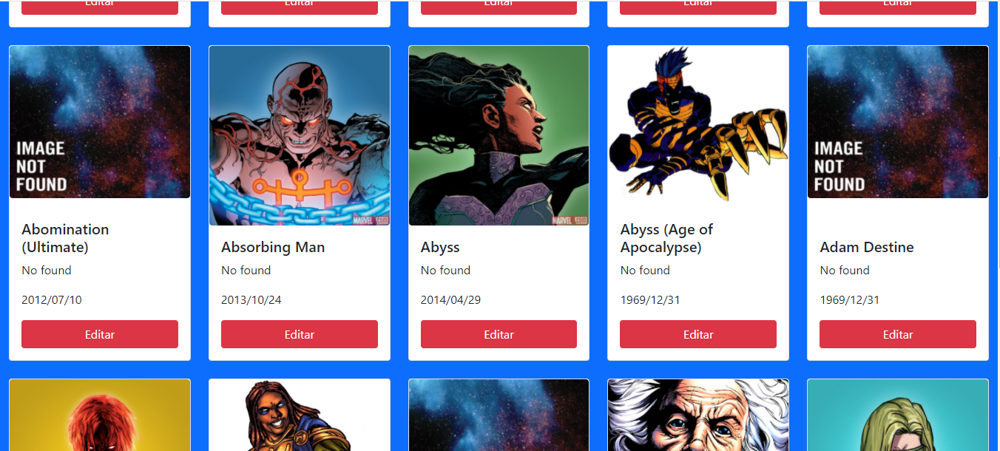
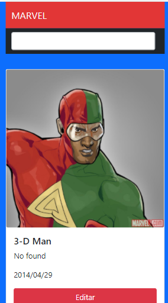

# Ejercicio 3  Marvel API 🎥

## Caracteristicas 🤓

- Carga básica de 20 héroes 
- Muestra nombre, miniatura, fecha de modificación(dd/mm/yyyy), y descripción de cada héroe.
- Búsquedad de héroes por nombre.  
- Cuenta con Modal para Editar información al mismo tiempo no esta funcional .

## Versiones Responsive

### Desktop

### Mobile

#### Tecnologías 🤖

* React.js
* NodeJS
* CSS
* Bootstrap 5
* npm
* Git
* Axios

